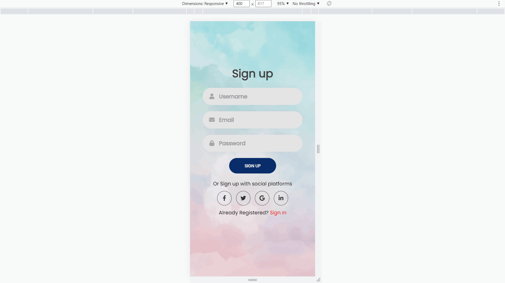

<p  align="right">
    
# Login Signup Page - Frontend Project
# Hi, I'm Soumya! 👋
## 🔗 Links
[](https://www.linkedin.com/in/soumya-raj-/)

This Project is all about frontend website development
    
## Run Locally

1. Download this project

    or

    You can clone it to your Github Account by executing the code below in your system terminal. (Ignore this step, If you have already downloaded)
```bash
  https://github.com/iSoumyaSinha/SigninSignup.git
```

💬 Ask me, If your project is not running - [Linkedin](https://www.linkedin.com/in/soumya-raj-/)


## 🛠 Skills Required for this Project...
HTML & CSS only...

## Tools Required
- [VS Code](https://code.visualstudio.com/download)
- [Live Server](https://marketplace.visualstudio.com/items?itemName=ritwickdey.LiveServer)
- [Chrome](https://www.google.com/chrome/thank-you.html?brand=JJTC&statcb=1&installdataindex=empty&defaultbrowser=0#)


## Desktop Screenshots

### Sign View

.png)
-

### Signup View


-

<hr></hr>

## Phone Screenshots

### Sign View


-

### Signup View


-


